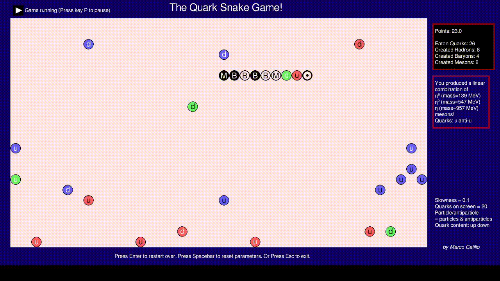

QCD-Snake Game
==============

This is a revised version of the famous snake game, but with the pedagogical puropose on learning something about hadron particles and High Energy Physics in the early stage of the Universe. It has been developed by Marco Catillo (myself) <mdotcat@gmail.com> specifically for the "Night of Physics" of June 17th 2022, at ETH University of Zurich, in Switzerland, in the attempt to explain quarks, gluons and hadrons to kids and families. This game is written in python with pygame.

## Setup the game
------------

### Installation

The program is meant to work on Linux Operative Systems, where python is installed from version 3.10.4 or later.
It schould already work in most of the Linux distros. You can install it with

        git clone https://github.com/mcatillo/qcdsnake
        bash qcdsnake/scripts/install.sh

### Uninstalling

For uninstalling this game conserve your folder *qcdsnake/*, and inside that folder double-click on

        clean.desktop

Or open the terminal in folder *qcdsnake/* and type:

        bash scripts/clean.sh

## Commands
---------

        Enter key     ->  Select game parameters or restart the game
        Space bar key ->  Go to play the game
        Arrows key    ->  Move the snake
        D key         ->  Go to game description
        P key         ->  Pause the game
        L key         ->  Change language: (EN/IT)
        M key         ->  Change monitor and rescale the window with the monitor size

## Documentation
-------------

### Physics part

Let us start with a few important facts in order to understand the game.
Quantum Chromodynamics is the theory of strong interaction. This interaction is the one which is responsible to keep the nucleai of our atoms together. It involves some of the smallest particles that we know to exist in Nature, the quarks and the gluons. Quarks are matter particles (like electrons, neutrinos  and so on), while gluons are the bosons which carry such strong interaction among quarks (like photons in electrodynamics). As far as we know we can't observe single quarks or gluons, but only their agglomerates, which are called hadrons. There two type of hadrons. Baryons, made by three quarks. These are for example the protons, neutrons and so on. Then we have the mesons, made by a couple of quark and anti-quark (which is simply the anti-particle of a quark), like pions, kaons and so on.

The aim of the game is to understand which quark content has each hadron and how they are combined together.
The important point is that all hadrons are said to be color singlet, where color is how we name the *charge* associated with the strong interaction, like the electric charge is associated with the electric interaction.
Nevertheless, while we can observe particles with a given electric charge, for example the electron is negative, the proton is positive and so on; hadrons have always zero color charge. In this sense they are called color singlets.
Apperently in the today Universe we don't have object which have non-zero color charge, and this is why we do not observe free quarks or free gluons. Because they have their own color charge.

However a few instants after the big bang the temperature of the Universe was so high that quarks and gluons used to stay together in a plasma (Quark-Gluon plasma). In this plasma you don't have only color singlet objects, but maybe something else. We still don't know exactly what really was the matter at that period and this is still under investigation by many particle physicists. It is possible that quarks and gluons behave like nearly free particles.

### The invented storytelling

The storytelling which I want to give in this game is that a snake living a few instants after the Big Bang was eating such quarks and creating hadrons starting from single quarks.
In order to have the so called color singlets, the snake has to eat consecutively three quarks with three different colors, in order to have baryons. Moreover, it has to eat a pair of quark and anti-quark of all three different colors for having a meson.
In this way you can increase your point through the game.

**The story of the snake is of course not true in reality and just invented for the game purpose**. However one can understand which quarks are needed for forming a given hadron, i.e. baryon or meson.
Because typically what you learn in school is that there are just protons and neutrons in the Universe. In reality there is a real zoo of particles of many types, with different quark content.
Playing this game can get a little used to such other particles which give a lot of interest to particle physicists.

## Acknowledgements

For this project I want to thank ETH Zurich for giving me the possibility of presenting this game at the event *Nacht der Physik*. Prof. Marina Marinkovic for supporting me in this. The whole Computational Physics group for which we had a lot of fun playing this game during the event. For this reason, I am  thankful to Javad Komijani, Roman Gruber, Joao P. Barros, Paola Tavella, Anian Altherr, Mika Lauk, Gabriele Pierini, Matteo D’anna and Thea Budde.

## Further information
---------------------

### Music & Images

Sounds, music and images are taken from different websites. In particular

1. the melody music (in *resources/melody.mp3*) by Spanac 05/07/2020 <https://www.freesoundslibrary.com/background-game-melody-loop/>
2. the ding sound (in *resources/ding.mp3*) by Spanac · 13/01/2018 <https://www.freesoundslibrary.com/ding-sound-effect/>
3. the crash sound (in *resources/crash.mp3*) by Spanac · 08/11/2019 <https://www.freesoundslibrary.com/crash-sound/>
4. the bubble sound (in *resources/bubble.mp3*) in <https://mixkit.co/free-sound-effects/game/>
5. the Galaxies images (in *resources/history4-1.png*) are taken from ESA website in <https://www.esa.int/ESA_Multimedia/Images/2022/05/A_dazzling_Hubble_collection_of_supernova_host_galaxies>
6. Earth picture (in *resources/history4-1.png*) taken by either Harrison Schmitt or Ron Evans in <http://tothemoon.ser.asu.edu/gallery/Apollo/17/Hasselblad%20500EL%2070%20mm> <https://www.flickr.com/photos/projectapolloarchive/21081863984/>

### Licensing

This software is licensed under the terms of MIT license. Please see LICENSE.txt for a full text of the license.

### Problems

For any problem or things that you want to improve in the game, please contact me via email: <mdotcat@gmail.com>. I will be happy to fix and give better versions of this game in the future.

